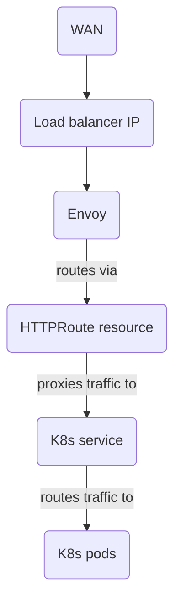

# Envoy Gateway

I use [Envoy Gateway](https://gateway.envoyproxy.io/) to provide ingress to my
cluster, with [Cilium](./cilium.md) providing the load balancing aspect.

The way I have it configured, Envoy consumes Kubernetes' [Gateway API](https://kubernetes.io/docs/concepts/services-networking/gateway/)
to set up routing to different services within the cluster, and uses TLS
certificates [cert-manager](../tools/cert-manager.md) generates to keep
everything encrypted on its way to the cluster.

