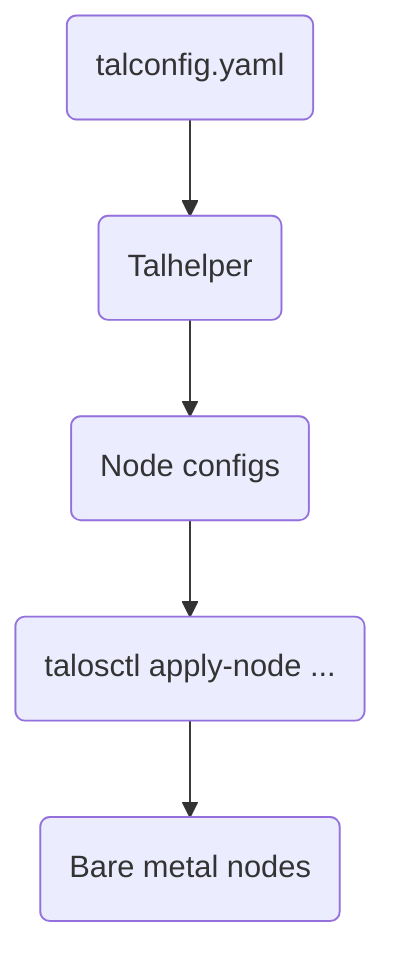

# Talos Linux

[Talos](https://www.talos.dev/) is an immutable, minimal Linux distribution
designed specifically for running Kubernetes. It removes traditional OS
components (SSH, package managers, shell access) in favor of a secure,
API-driven approach.

## Architecture



## Configuration Files

### Main Configuration Template

`talos/talconfig.yaml.j2` - Jinja2 template that defines:

- Cluster name and endpoint
- Kubernetes and Talos versions
- Node definitions (hostname, IP, disk, network)
- Patches to apply

```yaml
clusterName: phoebe
endpoint: https://10.80.0.8:6443

talosVersion: "{{ ENV.TALOS_VERSION }}"
kubernetesVersion: "{{ ENV.KUBE_VERSION }}"

nodes:
  - hostname: phoebe-k-ctrl-01
    controlPlane: true
    ipAddress: 10.60.0.10
    # ... additional config
```

### Secrets Template

`talos/talsecret.yaml.optpl` - 1Password template for cluster secrets:

- Cluster ID and secret
- Bootstrap token
- TLS certificates for etcd, Kubernetes, and Talos

Secrets are fetched from 1Password at configuration generation time.

### Schematic

`talos/schematic.yaml` - Defines the custom Talos image build:

```yaml
customization:
  extraKernelArgs:
    - amd_iommu=on      # PCI passthrough
    - iommu=pt
  systemExtensions:
    officialExtensions:
      - siderolabs/amdgpu
      - siderolabs/amd-ucode
      - siderolabs/nfsrahead
```

This schematic is submitted to Talos Factory to build a custom installer image.

## Patches

Patches modify the base Talos configuration. Located in `talos/patches/`:

### Global Patches (All Nodes)

- `machine-files.yaml` - Custom files to place on nodes
- `machine-kubelet.yaml` - Kubelet configuration and feature gates
- `machine-network.yaml` - Network settings
- `machine-sysctls.yaml` - Kernel parameters
- `machine-time.yaml` - NTP configuration

### Controller Patches (Control Plane Only)

- `cluster.yaml` - API server, etcd, and scheduler configuration

Example from `machine-kubelet.yaml`:

```yaml
machine:
  kubelet:
    defaultRuntimeSeccompProfileEnabled: true
    disableManifestsDirectory: true
    extraConfig:
      featureGates:
        ResourceHealthStatus: true
```

## Just Commands

The `talos/mod.just` file provides management commands:

### Generate Configuration

```bash
just talos genconfig
```

Generates node-specific configurations using talhelper.

### Apply Configuration

```bash
just talos apply-node <ip> [args]
```

Applies configuration to a specific node.

### Get Kubeconfig

```bash
just talos kubeconfig <ip>
```

Retrieves the cluster kubeconfig.

### Upgrade Talos

```bash
just talos upgrade <node> [args]
```

Upgrades a node to a new Talos version.

### Upgrade Kubernetes

```bash
just talos upgrade-k8s <node> [args]
```

Upgrades a node to a new Kubernetes version.

## Upgrade Process

### Talos Upgrades

1. Update `talosVersion` in `talconfig.yaml.j2`
2. Regenerate configuration: `just talos genconfig`
3. Upgrade each node one at a time:

```bash
just talos upgrade 10.60.0.10
```

4. Wait for node to reboot and rejoin
5. Repeat for remaining nodes

### Kubernetes Upgrades

1. Update `kubernetesVersion` in `talconfig.yaml.j2`
2. Regenerate configuration: `just talos genconfig`
3. Upgrade control plane first:

```bash
just talos upgrade-k8s 10.60.0.10
```

4. The upgrade propagates to worker nodes automatically

## Bootstrapping

Initial cluster bootstrap is handled by `bootstrap/mod.just`:

1. **Apply Talos config** to all nodes
2. **Bootstrap Kubernetes** on the control plane
3. **Wait for nodes** to be ready
4. **Create namespaces** from directory structure
5. **Apply CRDs** via Helmfile
6. **Install core apps** (Cilium, CoreDNS, Flux)
7. **Fetch kubeconfig** for cluster access

```bash
just bootstrap
```

## Custom Extensions

The schematic includes official Siderolabs extensions:

- `siderolabs/amdgpu` - AMD GPU driver support
- `siderolabs/amd-ucode` - AMD microcode updates
- `siderolabs/nfsrahead` - NFS read-ahead optimization

Extensions are built into the installer image via Talos Factory.

## Security Considerations

Talos provides:

- **Immutable root filesystem** - No runtime modifications
- **No SSH access** - All management via API
- **Secure boot support** - Verified boot chain
- **Minimal attack surface** - No shell, package manager, or unnecessary services

The schematic does disable some security features for performance:

> ⚠️ **Warning**: These are homelab-specific tradeoffs and should **not** be used in production environments. Disabling CPU vulnerability mitigations and security modules significantly increases the attack surface.

```yaml
extraKernelArgs:
  - mitigations=off    # CPU vulnerability mitigations disabled
  - security=none      # LSM disabled
```

## Troubleshooting

### Access Node Console

Use the Talos API:

```bash
talosctl dmesg -n <node-ip>
talosctl logs -n <node-ip> kubelet
```

### Check Cluster Health

```bash
talosctl health -n <node-ip>
talosctl etcd members -n <control-plane-ip>
```

### View Configuration

```bash
talosctl get machineconfig -n <node-ip> -o yaml
```

### Reset a Node

⚠️ Destructive operation:

```bash
talosctl reset -n <node-ip> --graceful
```
