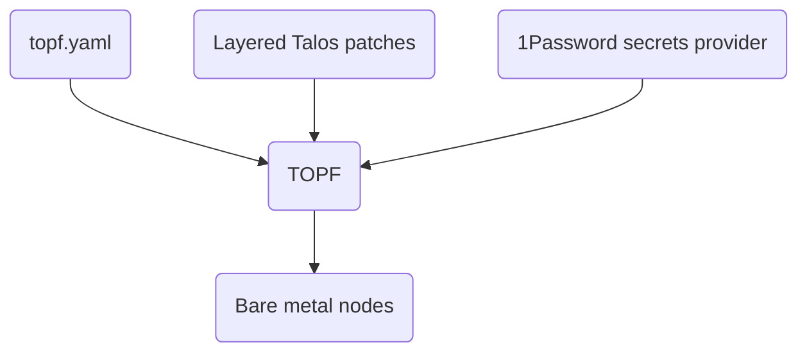

# Talos Linux

[Talos](https://www.talos.dev/) is an immutable, minimal Linux distribution
designed specifically for running Kubernetes. It removes traditional OS
components (SSH, package managers, shell access) in favor of a secure,
API-driven approach.

## Architecture


```mermaid
flowchart TD
    topfconfig(topf.yaml) --> topf(TOPF)
    patches(Layered Talos patches) --> topf
    secrets(1Password secrets provider) --> topf
    topf --> nodes
    nodes(Bare metal nodes)
```

## Configuration Files

### Main Configuration

`talos/topf.yaml` defines:

- Cluster name and endpoint
- Kubernetes and Talos versions
- Image Factory schematic and Secure Boot settings
- Node names, IPs, and roles

```yaml
clusterName: phoebe
clusterEndpoint: https://10.80.0.8:6443
kubernetesVersion: "1.37.0"
talosVersion: "1.14.0"
schematicId: "@schematic.yaml"
secureboot: true

nodes:
  - host: phoebe-k-ctrl-01
    ip: 10.70.0.186
    role: control-plane
```

### Secrets

`talos/secrets.yaml.optpl` is the 1Password template for the existing Talos
secrets bundle. `talos/secrets-provider` injects it on demand for TOPF, so
plaintext credentials and private keys are never written to the repository.
The bundle contains:

- Cluster ID and secret
- Bootstrap token
- TLS certificates for etcd, Kubernetes, and Talos

### Schematic

`talos/schematic.yaml` - Defines the custom Talos image build:

```yaml
customization:
  extraKernelArgs:
    - amd_iommu=on      # PCI passthrough
    - iommu=pt
  systemExtensions:
    officialExtensions:
      - siderolabs/amdgpu
      - siderolabs/amd-ucode
      - siderolabs/nfsrahead
```

This schematic is submitted to Talos Factory to build a custom installer image.

## Patches

TOPF layers patches in this order:

- `talos/all/` for every node
- `talos/control-plane/` for control-plane nodes
- `talos/worker/` for workers, when present
- `talos/node/<host>/` for one node

Patches use the Talos 1.14 multi-document API. Most settings are standalone
documents such as `KubeletConfig`, `ResolverConfig`, `VLANConfig`, and
`UnattendedInstallConfig`. Only fields still owned by the legacy document, such
as machine certificate SANs, machine features, and etcd settings, remain under
`machine:` or `cluster:`.

Example from `talos/all/07-kubelet.yaml`:

```yaml
apiVersion: v1alpha1
kind: KubeletConfig
defaultRuntimeSeccompProfileEnabled: true
config:
  featureGates:
    ResourceHealthStatus: true
```

## Just Commands

The `talos/mod.just` file provides management commands:

### Render Configuration

```bash
just talos render
```

Renders node-specific configuration into the ignored `talos/output/` directory
without applying anything.

### Apply Configuration

```bash
just talos apply --dry-run
just talos apply
just talos apply-node <host> [args]
```

Always review the dry-run before applying an existing cluster.

### Get Kubeconfig

```bash
just talos kubeconfig
just talos talosconfig
```

Generates client configuration from the existing secrets bundle.

### Upgrade Talos

```bash
just talos upgrade <host> --dry-run
just talos upgrade <host> [args]
```

TOPF upgrades the selected node to the Talos version and schematic declared in
`topf.yaml`.

### Upgrade Kubernetes

```bash
just talos upgrade-k8s <node> [args]
```

Upgrades a node to a new Kubernetes version.

## Upgrade Process

### Talos Upgrades

1. Update `talosVersion` in `talos/topf.yaml` and keep the `mise.toml` Talos
   client pins aligned.
2. Check and run the node upgrade. When moving from Talos 1.13 to 1.14, do
   this before applying the new multi-document configuration; Talos 1.14 can
   continue running the existing legacy configuration during the reboot.

```bash
just talos upgrade phoebe-k-ctrl-01 --dry-run
just talos upgrade phoebe-k-ctrl-01
```

3. Wait for the node to reboot and rejoin.
4. Review and apply the Talos 1.14 configuration:

```bash
just talos apply --dry-run
just talos apply
```

5. Repeat the node upgrade for remaining nodes, when present.

### Kubernetes Upgrades

1. Update `kubernetesVersion` in `talos/topf.yaml` and `KUBE_VERSION` in
   `mise.toml`.
2. Run a Kubernetes upgrade against a control-plane node:

```bash
just talos upgrade-k8s 10.70.0.186 --dry-run
just talos upgrade-k8s 10.70.0.186
```

3. The control-plane upgrade updates kubelet across the cluster.

## Bootstrapping

Initial cluster bootstrap is handled by `bootstrap/mod.just`:

1. **Apply Talos config and bootstrap Kubernetes** with TOPF
2. **Wait for nodes** to be ready
3. **Create namespaces** from directory structure
4. **Apply CRDs** via Helmfile
5. **Install core apps** (Cilium, CoreDNS, Flux)
6. **Fetch kubeconfig** for cluster access

```bash
just bootstrap
```

## Custom Extensions

The schematic includes official Siderolabs extensions:

- `siderolabs/amdgpu` - AMD GPU driver support
- `siderolabs/amd-ucode` - AMD microcode updates
- `siderolabs/nfsrahead` - NFS read-ahead optimization

Extensions are built into the installer image via Talos Factory.

## Security Considerations

Talos provides:

- **Immutable root filesystem** - No runtime modifications
- **No SSH access** - All management via API
- **Secure boot support** - Verified boot chain
- **Minimal attack surface** - No shell, package manager, or unnecessary services

The schematic does disable some security features for performance:

> ⚠️ **Warning**: These are homelab-specific tradeoffs and should **not** be used in production environments. Disabling CPU vulnerability mitigations and security modules significantly increases the attack surface.

```yaml
extraKernelArgs:
  - mitigations=off    # CPU vulnerability mitigations disabled
  - security=none      # LSM disabled
```

## Troubleshooting

### Access Node Console

Use the Talos API:

```bash
talosctl dmesg -n <node-ip>
talosctl logs -n <node-ip> kubelet
```

### Check Cluster Health

```bash
talosctl health -n <node-ip>
talosctl etcd members -n <control-plane-ip>
```

### View Configuration

```bash
talosctl get machineconfig -n <node-ip> -o yaml
```

### Reset a Node

⚠️ Destructive operation:

```bash
talosctl reset -n <node-ip> --graceful
```
