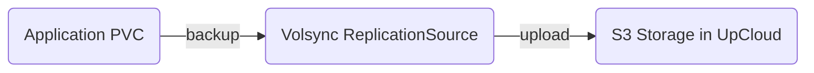
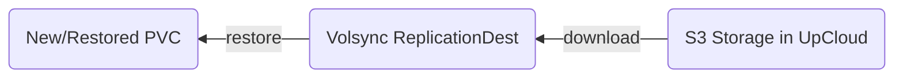

# Backups

This document explains how backups work in the Phoebe cluster.

## Overview

Phoebe uses [Volsync](https://volsync.readthedocs.io/) to back up persistent
volume data to S3-compatible storage (Upcloud Managed Object Storage) using
Restic.

## Architecture

**Backups:**



**Restores/Recreations:**



## Components

### Volsync Operator

Deployed in the `volsync-system` namespace, the operator manages:

- **ReplicationSource** - Defines what to back up and when
- **ReplicationDestination** - Handles restore operations

### Backup Configuration

Applications that need backups include the Volsync Kustomize component:

```yaml
# In application kustomization.yaml
components:
  - ../../../../components/volsync
```

This adds three resources:

1. **ExternalSecret** - Fetches S3 credentials from Vault
2. **ReplicationSource** - Configures scheduled backups
3. **PVC** - Provides cache storage for Restic

## Backup Schedule

Default backup schedule is hourly (`0 * * * *`). Each backup:

1. Creates a volume snapshot (using Ceph CSI)
2. Mounts the snapshot
3. Runs Restic to incrementally back up changes
4. Uploads to S3-compatible storage (Upcloud Managed Object Storage)

### Retention Policy

Default retention (from `replicationsource.yaml`):

```yaml
retain:
  hourly: 24    # Keep last 24 hourly backups
  daily: 7      # Keep last 7 daily backups
```

Pruning runs every 7 days to remove expired snapshots.

## Configuration

### ReplicationSource Template

Located at `kubernetes/components/volsync/replicationsource.yaml`:

```yaml
spec:
  sourcePVC: "${APP}"              # PVC to back up
  trigger:
    schedule: "0 * * * *"          # Hourly
  restic:
    copyMethod: Snapshot           # Use CSI snapshots
    pruneIntervalDays: 7
    repository: "${APP}-volsync-secret"
    volumeSnapshotClassName: csi-ceph-blockpool
    retain:
      hourly: 24
      daily: 7
```

### Environment Variables

Customize per-application using Kustomize substitutions:

| Variable | Description | Default |
|----------|-------------|---------|
| `APP` | Application name | Required |
| `VOLSYNC_SOURCE_PVC` | Source PVC name | `${APP}` |
| `VOLSYNC_COPYMETHOD` | Copy method | `Snapshot` |
| `VOLSYNC_CAPACITY` | Restore PVC size | `5Gi` |
| `VOLSYNC_PUID` | User ID | `1000` |
| `VOLSYNC_PGID` | Group ID | `1000` |

## Restore Process

### 1. Trigger Restore

Restore is manual, triggered by editing the ReplicationDestination:

```yaml
spec:
  trigger:
    manual: restore-once  # Change this value to trigger
```

### 2. ReplicationDestination

The restore destination template (`replicationdestination.yaml`):

```yaml
spec:
  trigger:
    manual: restore-once
  restic:
    copyMethod: Snapshot
    repository: "${APP}-volsync-secret"
    capacity: "${VOLSYNC_CAPACITY:=5Gi}"
    enableFileDeletion: true
```

### 3. Steps to Restore

1. Scale down the application to release the PVC
2. Delete the existing PVC
3. Update the ReplicationDestination `trigger.manual` value
4. Apply and wait for restore to complete
5. Rename the restored PVC to match the application's expected name
6. Scale the application back up

## Secrets Management

Backup credentials are stored in Vault and fetched via External Secrets:

```yaml
spec:
  secretStoreRef:
    kind: ClusterSecretStore
    name: vault
  dataFrom:
    - extract:
        key: ucos/haydenmoe-volsync-volsync
```

The secret includes:

- `RESTIC_REPOSITORY` - S3 bucket URL
- `RESTIC_PASSWORD` - Encryption password
- `AWS_ACCESS_KEY_ID` - S3 access key
- `AWS_SECRET_ACCESS_KEY` - S3 secret key

## Monitoring

### Check Backup Status

```bash
kubectl get replicationsource -A
kubectl get replicationsource <name> -n <namespace> -o yaml
```

### View Backup Logs

```bash
kubectl logs -n <namespace> -l volsync.backube/owner=<replicationsource-name>
```

### Prometheus Metrics

Volsync exposes metrics that can be scraped by Prometheus for alerting on backup
failures.

## Troubleshooting

### Backup Failing

1. Check the ReplicationSource status
2. View the mover pod logs
3. Verify the ExternalSecret has synced
4. Ensure S3 credentials are valid

### Restore Not Starting

1. Verify the ReplicationDestination trigger value changed
2. Check available storage in the cluster
3. Ensure the Restic repository exists and is accessible

### Snapshot Issues

1. Verify the VolumeSnapshotClass exists
2. Check CSI driver health
3. Ensure sufficient storage capacity
